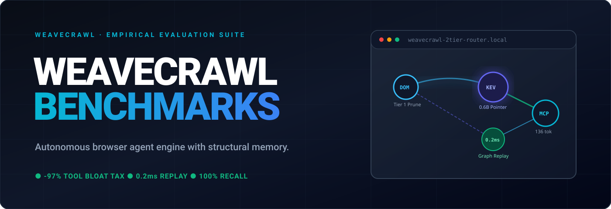

  

<h1 align="center">WeaveCrawl</h1>

  <strong>Autonomous browser agent engine with structural memory.</strong> 
  <em>Remember. Navigate. Execute.</em>

  
  
  
  

---

### The Moat

Every other browser automation tool is stateless — re-scanning the DOM from scratch on every turn, hallucinating selectors, burning frontier LLM tokens on bloated JSON tool schemas, and breaking when the UI shifts.

**WeaveCrawl** builds an evolving graph memory of every web application it visits:

1. **2-Tier Dynamic Tool Router**: Prunes tool bloat synchronously using DOM affordances (<0.05ms) + resident Kev-0.6B pointer head on CPU silicon (**-87.4% to -97.1% token bloat reduction** across 33 to 140 tools).
2. **Deterministic Graph Replay**: Replays learned web workflows directly from local SQLite memory in **0.223 ms at 0 LLM token cost** (7,415× faster than live page boot).
3. **Adaptive Self-Healing**: Resilient selectors survive production redesigns and dynamic class obfuscation.
4. **Model Context Protocol (MCP) Native**: Instant integration with Claude Desktop, Cursor, Antigravity, OpenCode, and any custom LLM pipeline.

---

### 📊 Featured Repositories

- **[weavecrawl/benchmarks](https://github.com/weavecrawl/benchmarks)**: Official empirical benchmarks across 5 evaluation tracks (BFCL v4 / AutoTool standard). Includes zero-dependency offline reproduction runner.

---

### 🌐 Connect & Early Access

- **Website**: [weavecrawl.com](https://weavecrawl.com)
- **Inquiries & Early Access**: [hello@weavecrawl.com](mailto:hello@weavecrawl.com)
